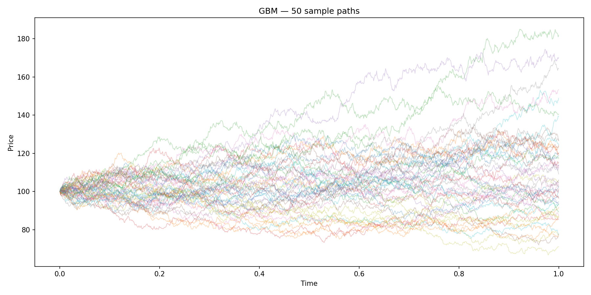

# Experiment 01: GBM Path Simulation
Run: `python -m experiments.gbm_paths.run`

## Setup

- S0=100, mu=0.05, sigma=0.2, T=1.0
- 1,000 paths, 1,000 time steps
- 50 sample paths plotted

## Assumptions (Black-Scholes world)

**About the stock price:**
1. Price follows GBM — continuous paths, no jumps
2. Drift mu and volatility sigma are constant over time
3. Volatility is the same regardless of strike or expiry (no vol smile)

**About the market:**
1. No arbitrage
2. No dividends
3. Continuous trading is possible at all times
4. Fractional share quantities are permitted
5. Risk-free rate r is constant and known

**About costs:**
1. No transaction costs or taxes
2. No restrictions on short selling

## Results

|       Metric        | Simulated |         Theoretical         |
|        ---          |    ---    |             ---             |
| Terminal price mean | 105.73      | S0 * exp(mu*T) = 105.13     |
| Terminal price std  | 22.30     |  sqrt(S0^2 * exp(2*mu*T) * (exp(sigma^2*T) - 1)) = 21.23                          |
| Log-return mean     | 0.0338      | (mu - 0.5*sigma^2)*T = 0.03 |
| Log-return std      | 0.2097     | sigma*sqrt(T) = 0.20        |

## Analysis

Simulated paths exhibit the defining properties of GBM: prices remain strictly positive, the spread fans out over time as uncertainty compounds, and there is no mean reversion.

The terminal price mean of 105.73 is within 0.57% of the theoretical value of 105.13 — well within Monte Carlo sampling error for 1,000 paths. The log-return mean (0.0338) and std (0.2097) both sit within 2% of their theoretical values of 0.03 and 0.20 respectively, confirming that the discretization introduces negligible bias at n_steps=1,000.

The Itô correction (-0.5*sigma^2 = -0.02) is visible in the data: the log-return mean (0.0338) is materially below mu (0.05), exactly as theory predicts. This is not an error — it reflects the cost of compounding under volatility. The same correction appears in the Black-Scholes formula and the risk-neutral pricing of every derivative in this project.

The terminal std of 22.30 reflects the wide spread visible in the path plot — at T=1.0 with sigma=0.2, a one-standard-deviation move corresponds to roughly a 22% price range around the mean.

## Open questions

- [ ] Terminal mean error is 0.57% at n_paths=1,000 — does it shrink proportionally to 1/sqrt(n_paths) as Monte Carlo theory predicts?
- [ ] Log-return std is 0.2097 vs theoretical 0.20 — does this converge to exactly sigma*sqrt(T) as n_steps increases, or does discretization introduce a persistent bias?
- [ ] Terminal std of 22.30 vs theoretical 21.23 (4.8% error) — does  this converge to the log-normal theoretical variance S0^2 * exp(2*mu*T) * (exp(sigma^2*T) - 1) as n_paths increases?