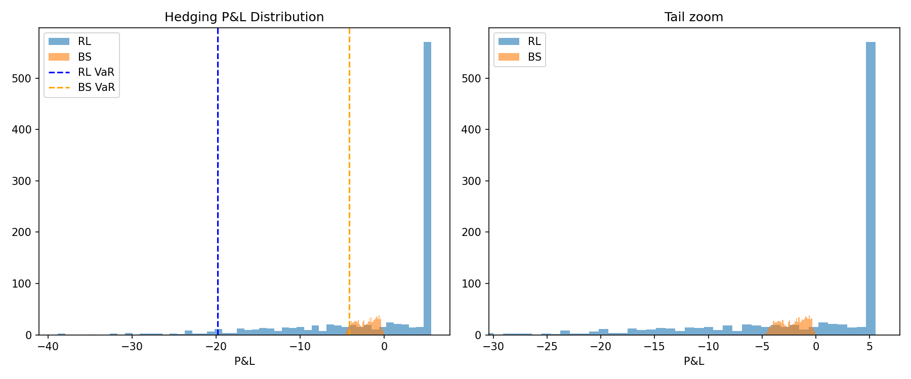

# Experiment 07: Hedging Tail Risk (VaR / CVaR)
Run: `python -m experiments.hedging_tail_risk.run`

## Setup

- Uses P&L distributions from Experiment 05 (PPO RL vs BS delta hedge)
- 95% VaR and CVaR computed on 1,000 episode P&L samples
- Histogram with tail zoom saved to `tail_risk.png`

Requires `experiments/ppo_hedging_vs_bs/results.npz` (run Experiment 05 first),
or will retrain if missing.

## Results

| Strategy | VaR 95% | CVaR 95% | CVaR/VaR |
|---|---|---|---|
| RL (PPO)  | 19.8308 | 25.9967 | 1.31 |
| BS delta  |  4.1595 |  4.3770 | 1.05 |

## Analysis

The results quantify precisely what it costs to deploy an under-trained RL hedging agent relative to the analytical benchmark.

**VaR:** The RL agent's 95% VaR of 19.83 is 4.8x larger than BS (4.16). In practical terms: on a bad day (worse than 95% of outcomes), the RL agent loses nearly $20 per unit notional while the BS hedge loses just $4.16. This is the direct cost of the agent's inconsistent hedge ratios — it is exposed to large directional moves that the BS delta position would have neutralized.

**CVaR/VaR ratio:** This is the key tail shape signal. BS achieves a ratio of 1.05 — CVaR barely exceeds VaR, meaning losses in the worst 5% of episodes cluster tightly just beyond the VaR threshold. The tail is thin and well-characterized by VaR alone. The RL agent's ratio of 1.31 reveals a fat tail: once you breach the VaR threshold, expected losses are 31% worse than VaR implies. Bad episodes for the RL agent do not just reach -19.83 — they blow through it.

**Basel III context:** Modern bank risk frameworks require reporting CVaR (Expected Shortfall) at 97.5% rather than VaR at 99% precisely because
of this fat-tail problem. VaR tells you where the tail starts; CVaR tells you how bad it gets inside the tail. The RL agent's CVaR/VaR ratio of 1.31 would flag immediately under any standard risk review.

**Root cause:** The RL agent's explained_variance of 0.107 after 500k timesteps (Experiment 05) indicates its value function has not learned to predict returns reliably. Without a good value estimate, the policy cannot distinguish episodes where aggressive hedging is needed from those where it is not — producing the wide, fat-tailed P&L distribution observed here.

## Open questions

- [ ] Modify reward to: reward = P&L - lambda * |P&L| and measure impact on CVaR/VaR ratio — does variance penalization produce a thinner tail without sacrificing mean P&L?
- [ ] Compute tail risk for the DQN American put agent (Experiment 03 payoffs) and compare CVaR/VaR profile to the hedging agent
- [ ] At what training timestep does RL VaR drop below 2x BS VaR? This is the practical convergence threshold for deployment